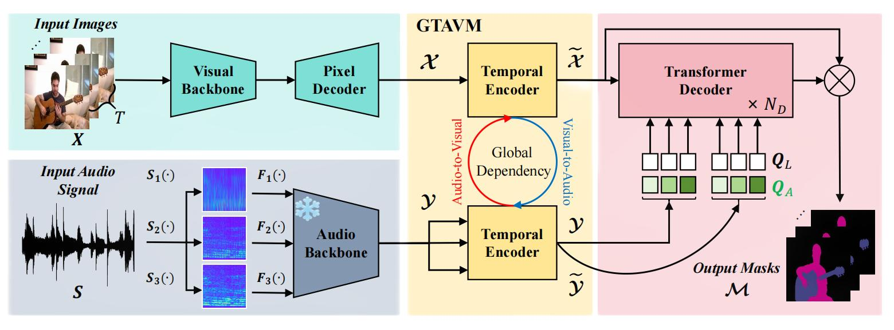

## NTAVS
This repository provides the PyTorch implementation for the paper "Nontrivial Audio-Visual Segmentation", which is submitted to Knowledge-Based Systems (KBS).

## Abstract
In mathematics, the adjective `trivial' is frequently used to refer to an object with a simple structure. Although it is counterintuitive to imagine that a multimodal task such as audio-visual segmentation (AVS) can be trivial, the trivial acoustic features possessed by the existing AVS models tremendously limit their performance. Indeed, acoustic features are normally averaged and repeated in the time-frequency domain to fit the sizes of visual features used in previous approaches. Thus, the triviality of these acoustic features degrades the effectiveness of audio-visual fusion and segmentation. In contrast, a novel global temporal audio-visual mixer (GTAVM) is proposed in this work; this approach fuses globally the temporal dependencies of audio and visual features along the input video sequence, transforming the average of the acoustic features into the average of the global temporal relations. Therefore, the acoustic features are able to maintain their sizes and generate nontrivial audio queries for segmentation purposes. To further enrich the acoustic features, a hierarchical audio backbone, in which multiple time-frequency resolutions are utilized to generate hierarchical Mel-spectrograms as audio inputs, is proposed in this work. Extensive experiments conducted on three AVS benchmarks demonstrate the state-of-the-art performance of the proposed methods.

## Method
<p align="center">
  

<h6 align="center">Overview of the proposed NTAVS.</h6>
</p>

## Preparation
We follow [COMBO](https://yannqi.github.io/AVS-COMBO) to finish the preparation before training and testing the models. The details are as follows:

### 1. Environments

- Linux or macOS with Python ≥ 3.6

```shell
# creat the conda environment
conda env create -f NTAVS.yaml
# build MSDeformAttention
cd models/modeling/pixel_decoder/ops
sh make.sh
```

- Preprocessing for detectron2

  For using Siam-Encoder Module (SEM), we refine 1-line code of the detectron2.

  The refined file that requires attention is located at:

  `conda_envs/xxx/lib/python3.xx/site-packages/detectron2/checkpoint/c2_model_loading.py`
  (refine the `xxx`  to your own environment)

  Commenting out the following code in [L287](https://github.com/facebookresearch/detectron2/blob/cc9266c2396d5545315e3601027ba4bc28e8c95b/detectron2/checkpoint/c2_model_loading.py#L287) will allow the code to run without errors:

```python
# raise ValueError("Cannot match one checkpoint key to multiple keys in the model.")  
```

- Install Semantic-SAM (Optional)

```shell
# Semantic-SAM
pip install git+https://github.com/cocodataset/panopticapi.git
git clone https://github.com/UX-Decoder/Semantic-SAM
cd Semantic-SAM
python -m pip install -r requirements.txt
```
Find out more at [Semantic-SAM](https://github.com/UX-Decoder/Semantic-SAM)

### 2. Datasets

Please refer to the link [AVSBenchmark](https://github.com/OpenNLPLab/AVSBench) to download the datasets. You need to put the data under the `./AVS_dataset`. The folder tree shall look like:

```
|--AVS_dataset
   |--AVSBench_semantic/
   |--AVSBench_object/Multi-sources/
   |--AVSBench_object/Single-source/
```

Then run the scripts below to preprocess the AVSS dataset for efficient training.

```shell
python3 avs_tools/preprocess_avss_audio.py
python3 avs_tools/process_avssimg2fixsize.py
```

### 3. Download Pre-Trained Models

- The pretrained visual backbone (ResNet-50 and PVT-v2) is available from benchmark AVSBench pretrained backbones [YannQi/COMBO-AVS-checkpoints · Hugging Face](https://huggingface.co/YannQi/COMBO-AVS-checkpoints).
- The pretrained acoustic backbone (CED-Mini) is available from [CED-Mini](https://huggingface.co/mispeech/ced-mini).

After you finish downloading, put the weights under the `./pretrained`. 

```
|--pretrained
   |--detectron2/R-50.pkl
   |--detectron2/d2_pvt_v2_b5.pkl
   |--audiotransformer_mini_mAP_4896.pt
```

### 4. Maskiges pregeneration

- Generate class-agnostic masks (Optional)

```shell
sh avs_tools/pre_mask/pre_mask_semantic_sam_s4.sh train # or ms3, avss
sh avs_tools/pre_mask/pre_mask_semantic_sam_s4.sh val 
sh avs_tools/pre_mask/pre_mask_semantic_sam_s4.sh test
```

- Generate Maskiges (Optional)

```shell
python3 avs_tools/pre_mask2rgb/mask_precess_s4.py --split train # or ms3, avss
python3 avs_tools/pre_mask2rgb/mask_precess_s4.py --split val
python3 avs_tools/pre_mask2rgb/mask_precess_s4.py --split test
```

- Move Maskiges to the following folder
  Note: For convenience, we provide pre-generated Maskiges for S4\MS3\AVSS subset on the [YannQi/COMBO-AVS-checkpoints · Hugging Face](https://huggingface.co/YannQi/COMBO-AVS-checkpoints).

```
|--AVS_dataset
    |--AVSBench_semantic/pre_SAM_mask/
    |--AVSBench_object/Multi-sources/ms3_data/pre_SAM_mask/
    |--AVSBench_object/Single-source/s4_data/pre_SAM_mask/
```

### 5. Train

```shell
# ResNet-50
sh scripts/res_train_avs4.sh # or ms3, avss
```

```shell
# PVTv2
sh scripts/pvt_train_avs4.sh # or ms3, avss
```

### 6. Test

```shell
# ResNet-50
sh scripts/res_test_avs4.sh # or ms3, avss
```

```shell
# PVTv2
sh scripts/pvt_test_avs4.sh # or ms3, avss
```

